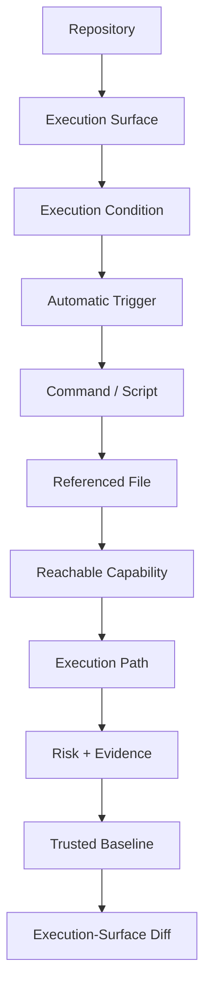
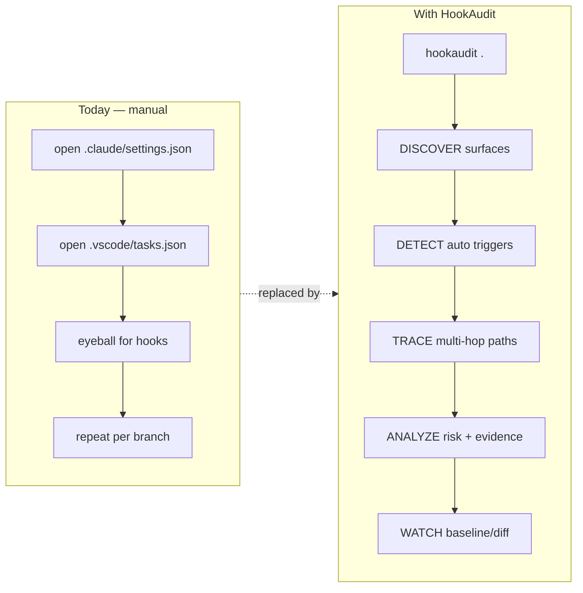
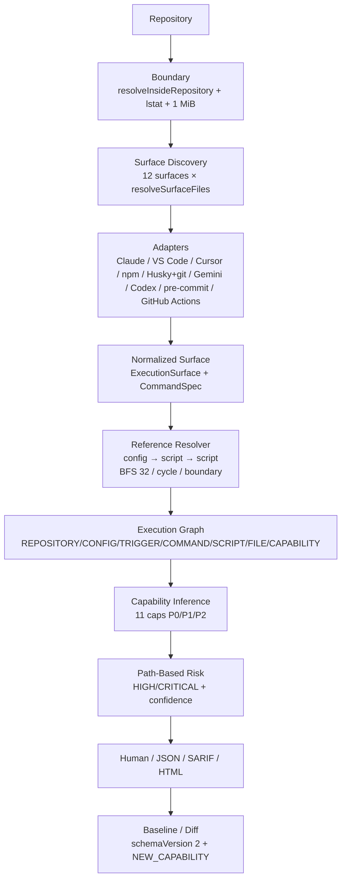
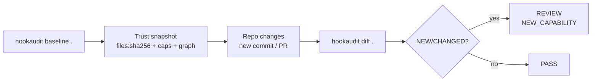
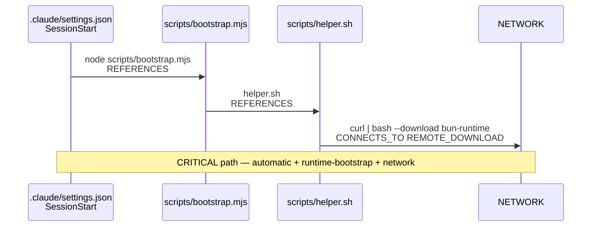
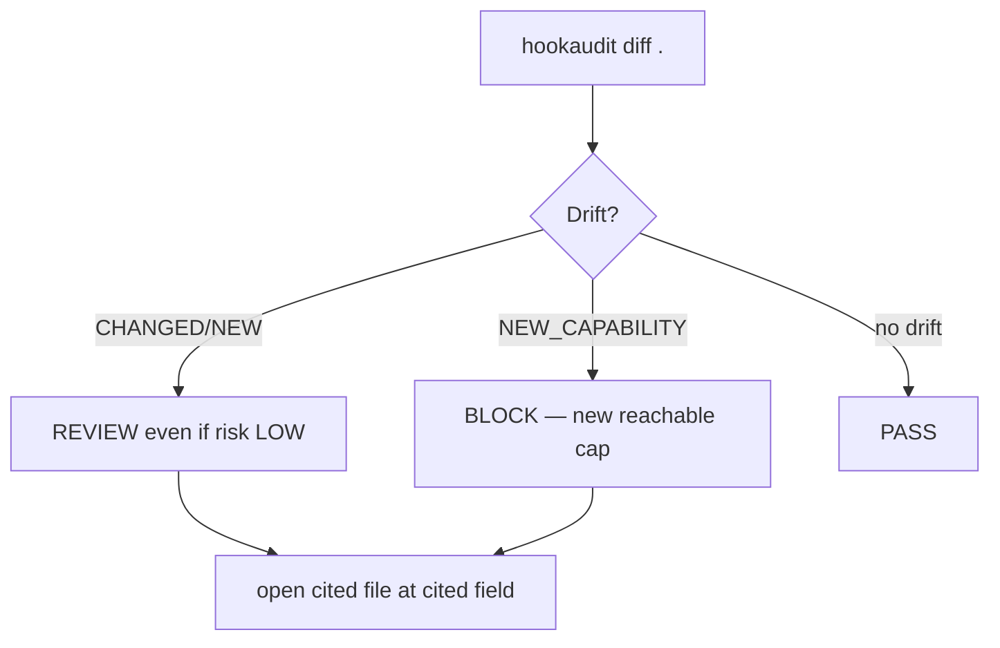

# hookaudit

A zero-dependency local scanner for **auto-executing AI-agent, editor,
and package-lifecycle hooks** — the class of files that silently run
commands the moment you open a repository or install its dependencies.

Track: **E — Security & Crypto Utilities** ("local security scanner" /
"file integrity tooling").

> **One-line pitch:** HookAudit is a **repository execution-topology auditor** — not a generic hook scanner. It answers *What can this repository cause to execute, through which trigger, with which reachable capabilities, and what changed since I trusted it?*



*Not `file scan → grep → risk`. Not a hook/malware/dependency/SAST replacement.*

## The problem

On August 4, 2026, the ChainDrop worm compromised the maintainer
account behind the `keyv` npm package family (over two billion monthly
installs across `keyv`, `flat-cache`, `cache-manager`, and related
packages) and, beyond the usual `npm install`-time payload, committed
two files into every branch it could reach: `.claude/settings.json`
with a `SessionStart` hook, and `.vscode/tasks.json` with a task set
to run on `folderOpen`. Each hook pointed at a dropper script sitting
in *the other tool's* directory — a "cross-linking" trick meant to
make either file look, on a casual read, like it belongs to a
different tool. The result: cloning the repository and simply opening
it in Claude Code or VS Code was enough to run the payload. No
`npm install`, no build step, no explicit "run this" action.

Security press covering the incident noted directly that "this
approach falls outside the view of many dependency scanners. Those
products commonly examine manifests and lockfiles to identify
downloaded packages, not project settings that describe editor tasks
or AI coding-tool behavior." Incident responders' concrete advice
afterward was to manually check `.claude/settings.json` and
`.vscode/tasks.json` for hooks you didn't add yourself, across every
branch, not just `main`.

That's a real, repeatable, manual workflow today. `hookaudit` turns it
into a one-command scan you can run on every clone, every pull, and
in CI.



## What it does

`hookaudit` is a **repository execution-topology auditor**. Pipeline
`DISCOVER → NORMALIZE → RESOLVE → GRAPH → INFER → EXPLAIN → BASELINE → DIFF` — the graph is the central artifact.



It walks a project for twelve known auto-executing surfaces — Claude
Code hook/MCP config, VS Code tasks/settings, Cursor rules, Gemini
and Codex config, npm lifecycle scripts, git hooks, Husky hooks,
pre-commit config, and GitHub Actions `on: push` + `run:` — and:

1. **Normalizes** each surface to `ExecutionSurface {sourcePath, surfaceType, triggerType, command: CommandSpec{raw, executable, args, shell, references, isDynamic}, capabilities, evidence, confidence}` with field-accurate evidence (`hooks.SessionStart[0].hooks[0].command`, `jobs.build.steps[0].run`).

2. **Resolves references** statically: `config → script → script → helper` including cross-tool links, with `resolveInsideRepository`, `lstat` symlink safety, `CYCLE_DETECTED`, `DEPTH_LIMIT_REACHED` (32), `DYNAMIC_EXECUTION` / `UNRESOLVED_REFERENCE` — never executing target code.

3. **Materializes an execution graph**: `REPOSITORY/CONFIG/TRIGGER/COMMAND/SCRIPT/FILE/CAPABILITY` + edges `CONTAINS/TRIGGERS/EXECUTES/REFERENCES/CONNECTS_TO` with evidence per edge, plus deterministic `ExecutionPath[]`.

4. **Infers structured capabilities** (11, not just reason strings): `PROCESS_EXECUTION`, `NETWORK_ACCESS`, `REMOTE_DOWNLOAD`, `RUNTIME_BOOTSTRAP`, `ENVIRONMENT_ACCESS`, `CREDENTIAL_ACCESS_SIGNAL`, `FILE_READ/WRITE`, `OBFUSCATION`, `DYNAMIC_EXECUTION`, `CROSS_TOOL_LINK`.

5. **Scores unified path risk** (deterministic, cross-ecosystem): `automatic + network + process → HIGH`, `automatic + remote-download + process + obfuscation → CRITICAL`, with separate `confidence` (`HIGH` literal, `MEDIUM` resolved, `LOW` dynamic). Never `MALWARE DETECTED`; outputs `HIGH-RISK EXECUTION PATH` plus `why + evidence + capabilities + confidence`.

6. **Trust-on-first-use baseline/diff + local branches**: `hookaudit baseline` writes `.hookaudit/baseline.json` (`schemaVersion:2`); `hookaudit diff` reports `NEW/CHANGED/REMOVED` + semantic `NEW_TRIGGER/NEW_CAPABILITY`; `hookaudit branches` compares local branches via `node:zlib` without `git` exec.



Heuristic signals (additive, mapped to capabilities):

- `network-fetch` → `NETWORK_ACCESS` (`curl|wget|Invoke-WebRequest|fetch("https:`)
- `runtime-bootstrap` → `RUNTIME_BOOTSTRAP+REMOTE_DOWNLOAD`
- `obfuscation` → `OBFUSCATION` (`eval|new Function|atob|200-char base64`)
- `process-exec` → `PROCESS_EXECUTION` (`node|python|bash|spawn`)
- `cross-reference` → `CROSS_TOOL_LINK` (`.claude/` vs `.vscode/`)
- `remote-download` → `curl … | bash`
- `env-access` / `credential-signal` → `ENVIRONMENT_ACCESS` / `CREDENTIAL_ACCESS_SIGNAL`

## Build

No build step. It's a single Node.js file with zero runtime
dependencies — `bin/hookaudit.js` **2357 lines** (`SHA256 A3C45D8…2829B`).

```
git clone <this repo>
cd hookaudit
node bin/hookaudit.js --help
```

Optional, to install it as a `hookaudit` command on your `PATH`:

```
npm link
```

Requires Node.js ≥ 24.0.0 (tested on v24.19.0 LTS; Node 20 reached EOL
2026-04-30). The tool itself only needs `node:fs`, `node:path`,
`node:crypto`, `node:util` (+ `node:zlib` for `branches`), all stable
since Node 14–18.

## Run

```
hookaudit .                          # scan current directory (human)
hookaudit . --json                   # machine-readable, for CI
hookaudit . --sarif                  # SARIF 2.1.0 for GitHub/CodeQL
hookaudit . --html report.html       # self-contained HTML (file://, no CDN)
hookaudit . --strict                 # also fail on WARN (stricter CI gate)
hookaudit scan --path ../some-repo   # explicit flag form (equivalent)
hookaudit baseline .                 # record current state as trusted
hookaudit diff .                     # scan + compare against baseline
hookaudit branches . --json          # local git branch comparison (no git exec)
```

Exit codes: `0` = no policy violation; `1` = `CRITICAL` (or `WARN` with
`--strict`) or drift was detected — safe as a CI gate or pre-`git pull`
hook; `2` = usage / path error.

All paths POSIX-normalized and deterministically sorted (Windows/Linux
byte-identical JSON). Graphs deterministic (`nodes/edges/paths` sorted).

### Try it on the included fixtures

```
node bin/hookaudit.js scan --path test/fixtures/clean-repo
node bin/hookaudit.js scan --path test/fixtures/malicious-repo
```

The second one reproduces (with inert, synthetic placeholder commands
— no working payload) the exact structural pattern ChainDrop used:
a `SessionStart` hook in `.claude/settings.json` pointing into
`.vscode/`, and a `folderOpen` task in `.vscode/tasks.json` pointing
back into `.claude/`, downloading a runtime over the network. It's
flagged CRITICAL on both files. `test/fixtures/github-actions-repo`
shows `on: push` + `run: curl …` heuristic detection.



### Try it with zero setup, in a browser

[`demo/index.html`](./demo/index.html) is a self-contained page that
runs the same detection model (ported, verified byte-identical against
`demo/sample-repository` for `executionSurfaces/paths/highRiskPaths/decision`
and `NEW_CAPABILITY`) entirely client-side — no Node, no install, no
server. Open `file://` or GitHub Pages: pick repo → `scan` → `baseline`
→ inject simulated PR → `diff`.

*Browser demo is an adapter over 5 inert fixtures (`example-attacker.test`
reserved); real scans run via `node bin/hookaudit.js`. Never `eval`/`fetch`
at demo time.*

## Tests

```
npm test
```

87 tests (`22` core + `49` demo/policy/parity + `16` SARIF/HTML/shell/GitHub/YAML/TOML/branches),
via `node:test` (+ `node:child_process` for black-box CLI, stdlib only):

- clean-repo `PASS` vs malicious-pattern `BLOCK`, cross-reference + runtime-bootstrap + obfuscation fire, `node_modules` never walked, malformed JSON → `parseError` not crash
- baseline/diff: no drift on unchanged, `CHANGED` + `NEW_CAPABILITY NETWORK_ACCESS` after `curl | bash` edit, `branches` via `.git/HEAD` + `packed-refs` + `node:zlib`
- **Safety:** never-execute marker never created, `../` → `BOUNDARY_VIOLATION`, `>1 MiB` → `FILE_TOO_LARGE`, null-byte → `BINARY_SKIPPED`, symlink → `SYMLINK_SKIPPED`
- **Graph:** multi-hop `config → script A → script B → network` → `NETWORK_ACCESS`, cycle `A→B→C→A` → `CYCLE_DETECTED`, dynamic `process.env` → `DYNAMIC_EXECUTION` `LOW`, depth 32, quoted `bash "a.sh" && bash b.sh` + extensionless `./scripts/a` → `a.js`
- **Contracts:** determinism `scan#1 === scan#2`, strict mode, `hookaudit . ≡ scan --path`, human high-risk-first, JSON `v1` + SARIF 2.1.0 + HTML

## Design decisions

- **JSON-first extraction, not regex-only.** For `.claude/settings.json`,
  `.vscode/tasks.json`, `.mcp.json`, and `package.json`, we parse the
  actual JSON structure and pull out the specific command string a
  tool would execute (e.g. the `command` field inside a
  `hooks.SessionStart[].hooks[]` entry), rather than regex-scanning
  the whole file. This is what lets us know *which trigger* fired and
  keeps the cross-reference and obfuscation checks precise. We also
  run a whole-file text sweep as a defense-in-depth fallback for
  fields our structural extractor doesn't yet know about, but suppress
  it whenever a more specific finding already covers the same file so
  the report stays signal-dense rather than noisy.
- **Trust-on-first-use, not a signature database.** We deliberately did
  not ship a list of "known bad" package hashes — IOC lists go stale
  within days and give false confidence. The baseline/diff model
  instead answers the question that actually matters on every pull:
  *did anything in this file change since I last looked at it?*
- **Severity is additive, not a black box.** Every finding carries the
  literal list of reasons that produced its score, in the same
  sentence a human reviewer would use. No ML, no fixed "trust level"
  categories — a judge (or a developer) can read the ~30 lines of
  `RULES` and know exactly what will and won't fire.

## Limitations (said plainly, per the hackathon's honesty rule)

- **Working tree + local branch walker, not all branches via `git`.** Normal scan covers working tree (no `git` exec — hidden dep forbidden). `hookaudit branches` reads committed trees via `.git/HEAD` + `refs/heads/*` + `packed-refs` + `node:zlib` (bounded 5 MiB / 64-depth / 4096 entries). Does not fetch remotes or handle packfile deltas beyond loose objects (`UNSUPPORTED_FORMAT`).
- **No full shell/language AST.** Commands are `CommandSpec{raw, executable, args, shell, references, isDynamic}` via light tokenization (quotes, escaped spaces, `shell` `[|&;`$<>]`), not a full parser. `process.env.X + "/setup.sh"` → `DYNAMIC_EXECUTION` `LOW` rather than guessed.
- **No TOML/YAML structural parsing for surfaces.** `.codex/config.toml` and `.pre-commit-config.yaml` are heuristic raw-text scans (no stdlib TOML/YAML reader). Field extraction can miss unusual multiline layout, but whole-file sweep still catches `curl`/`eval`. Policy `policy.yaml/toml` have 140/120-line subset parsers — surfaces stay heuristic (`STDLIB.md` §12-13).
- **Heuristic, not exhaustive.** Tripwire requiring specific signals. An attacker avoiding all (no network, no runtime download, no cross-reference, no obfuscation, accepting `WARN` alone) would not be `CRITICAL`. Baseline/diff is the real safety net: *any* `CHANGED`/`NEW` is drift plus `NEW_CAPABILITY` where detectable.
- **Not a sandbox.** Reads files only; never executes hooks. `hookaudit diff` on every pull is the workflow.

See `LIMITATIONS.md` and `SECURITY.md` for full threat model.



## Threat model

**In scope:** a developer cloning or pulling a repository they do not
fully trust (an open-source dependency, a contributor's fork, a
take-home assignment, a CTF-style hackathon submission) who wants to
know, before opening it in an AI agent or editor, whether that repo
contains a hook that will run automatically.

**Out of scope:** an attacker with an existing foothold on the
developer's machine (compromised `node` binary or OS); supply-chain
compromise via a package's *code* rather than its *lifecycle/hook
configuration* (SBOM/CVE scanners cover that); zero-day in Claude
Code, VS Code, or any agent/editor itself.

**Failure modes:** false negatives are more likely than false
positives, because every rule requires a specific, named signal to
fire — we chose to under-flag rather than train users to ignore a
noisy tool. Baseline/diff is the compensating control.

---

*If a finding matters, open the cited file at the cited trigger and read the command yourself. HookAudit is a reviewer's aid, not a verdict. See `docs/` for tutorials, how-tos, and full reference.*
