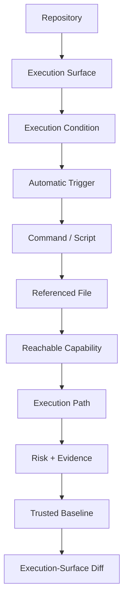
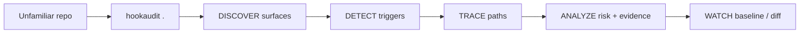
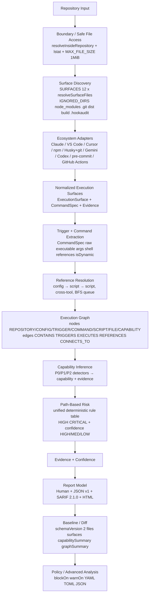
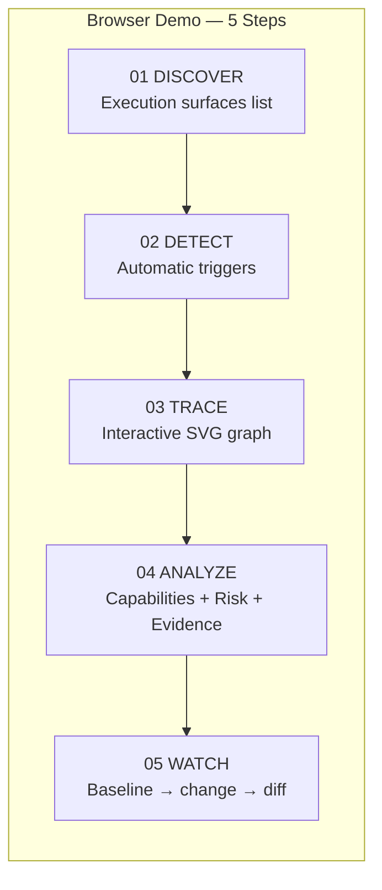

# HookAudit — Repository Execution-Topology Security Auditor

A zero-dependency local auditor for **repository-controlled automatic execution behavior** — the class of configuration that can cause commands to run the moment you open, install, or interact with a repository.

Track: **E — Security & Crypto Utilities** (“local security scanner” / “file integrity tooling”).  
Runtime: **zero third-party dependencies** · `node:fs` `node:path` `node:crypto` `node:util` `node:zlib` only · single file `bin/hookaudit.js` **2357 lines** (`SHA256 A3C45D8…2829B`)

---

## One-line pitch

HookAudit is a **zero-dependency local repository execution-topology auditor** — it discovers repository-controlled execution surfaces across AI-agent, IDE/workspace, package-lifecycle, and development-hook systems, resolves multi-hop execution paths, maps reachable capabilities, explains contextual risk with evidence, and detects execution-surface changes against a trusted baseline.

---

## Core product truth

HookAudit is **NOT a generic hook scanner**.

It analyzes repository-controlled execution behavior and turns fragmented repository automation into an explicit execution topology.

**Core question:**

> What can this repository cause to execute, through which trigger, with which reachable capabilities, and what changed since I trusted it?

**Secondary but central question:**

> What automatic execution behavior is controlled by this repository?

Preserving this distinction is a documentation requirement — not marketing.

> A hook scanner asks “is there a hook?” HookAudit asks “what is the hook → when does it fire → what command does it invoke → what file does that reach → what does that file invoke → what capabilities become reachable → what is the resulting execution path?”

---

## Product model (the product story)

This is the product model — how a user should think about the product. It is not the software architecture.



Not:

```text
file scan → grep → risk
```

and not:

```text
hook scanner / malware scanner / dependency scanner / SAST replacement
```

---

## Five product experience steps

These are the product experience — not the internal software architecture.

| # | Step | User question | Product answer |
|---|------|---------------|----------------|
| 01 | **DISCOVER** | What execution surfaces does this repository control? | Enumerate repository-controlled surfaces across ecosystems |
| 02 | **DETECT** | Under which documented execution condition can a surface run automatically? | Identify trigger type + condition (`SessionStart`, `folderOpen`, `preinstall`, `on: push`, …) |
| 03 | **TRACE** | What does it reach, and does it cross tools? | Resolve local references statically: `config → script → script → helper`, including cross-tool links |
| 04 | **ANALYZE** | What capabilities are reachable, and how risky is the path? | Infer structured capabilities, explain path-based risk, confidence, and evidence |
| 05 | **WATCH** | What changed since I trusted this surface? | Create a trusted baseline and detect new or changed execution behavior |

User flow:



---

## Core engine architecture (the implementation)

This is the internal architecture — not the product story. The graph is the central technical asset.



Pipeline shorthand: `DISCOVER → NORMALIZE → RESOLVE → GRAPH → INFER → EXPLAIN → BASELINE → DIFF` — the graph is the central product artifact.

Adapters never own risk; detectors never become graph. Single file `bin/hookaudit.js`, frozen core, zero runtime deps.

---

## The problem

On August 4, 2026, the ChainDrop worm compromised the maintainer account behind the `keyv` npm package family (over two billion monthly installs across `keyv`, `flat-cache`, `cache-manager`, and related packages) and, beyond the usual `npm install`-time payload, committed two files into every branch it could reach: `.claude/settings.json` with a `SessionStart` hook, and `.vscode/tasks.json` with a task set to run on `folderOpen`. Each hook pointed at a dropper script sitting in *the other tool’s* directory — a “cross-linking” trick meant to make either file look, on a casual read, like it belongs to a different tool. The result: cloning the repository and simply opening it in Claude Code or VS Code was enough to run the payload. No `npm install`, no build step, no explicit “run this” action.

Security press covering the incident noted directly that “this approach falls outside the view of many dependency scanners. Those products commonly examine manifests and lockfiles to identify downloaded packages, not project settings that describe editor tasks or AI coding-tool behavior.” Incident responders’ concrete advice afterward was to manually check `.claude/settings.json` and `.vscode/tasks.json` for hooks you didn’t add yourself, across every branch, not just `main`.

That manual workflow exists today. `hookaudit` turns it into a one-command scan you can run on every clone, every pull, and in CI.

---

## What it does

`hookaudit` is a **repository execution-topology auditor** answering *What can this repo cause to execute, through which trigger, with which reachable capabilities, and what changed since I trusted it?*

1. **Normalizes** each surface to `ExecutionSurface {id, sourcePath, surfaceType, triggerType, command: CommandSpec{raw, executable, args, shell, references, isDynamic}, capabilities, evidence, confidence}` with field-accurate evidence (`hooks.SessionStart[0].hooks[0].command`, `tasks[0].command`, `scripts.postinstall`, `jobs.<name>.steps[].run`).

2. **Resolves references** statically: `config → script → script → helper` including cross-tool links, with repository boundary checks (`resolveInsideRepository`), symlink safety (`lstat`), cycle detection (`CYCLE_DETECTED`), depth limit `MAX_GRAPH_DEPTH=32` (`DEPTH_LIMIT_REACHED`), and dynamic handling (`DYNAMIC_EXECUTION`, `UNRESOLVED_REFERENCE`, `PARTIALLY_RESOLVED`) — never executing target code.

3. **Materializes an execution graph**: nodes `REPOSITORY / CONFIG / TRIGGER / COMMAND / SCRIPT / FILE / CAPABILITY` and edges `CONTAINS / TRIGGERS / EXECUTES / REFERENCES / CONNECTS_TO` with evidence per edge, plus deterministic `ExecutionPath[]` showing full `trigger → command → script` chains. Paths are POSIX-normalized and lexicographically sorted for byte-identical output on Windows and Linux.

4. **Infers structured capabilities** (not just reason strings): `PROCESS_EXECUTION`, `NETWORK_ACCESS`, `REMOTE_DOWNLOAD`, `RUNTIME_BOOTSTRAP`, `ENVIRONMENT_ACCESS`, `CREDENTIAL_ACCESS_SIGNAL`, `FILE_READ`, `FILE_WRITE`, `OBFUSCATION`, `DYNAMIC_EXECUTION`, `CROSS_TOOL_LINK` — detectors are reusable evidence producers (`RULES[]` 9 detectors + cross-tool).

5. **Scores unified path risk** (deterministic, rule-based, transparent, cross-ecosystem — adapters do not score): `automatic + network + process → HIGH`, `automatic + remote-download + process + obfuscation → CRITICAL`, with separate `confidence` (`HIGH` literal, `MEDIUM` resolved, `LOW` dynamic). Never `MALWARE DETECTED`; outputs `HIGH-RISK EXECUTION PATH` plus `why + evidence + capabilities + confidence + recommendation`.

6. **Supports trust-on-first-use baseline/diff**: `hookaudit baseline` writes `.hookaudit/baseline.json` (`schemaVersion:2`, `files:{path:sha256}`, `surfaces`, `capabilitySummary`, `graphSummary`); `hookaudit diff` reports `NEW / CHANGED / REMOVED` plus semantic `NEW_TRIGGER / CHANGED_COMMAND / NEW_CAPABILITY` and `NEW_REFERENCE` where resolvable. Also `hookaudit branches` for local git branch comparison without `git` exec (via `node:zlib`).

Safety guards: `MAX_FILE_SIZE=1 MiB → FILE_TOO_LARGE`, binary heuristic (null-byte + >30% non-printable in first 1 KiB) → `BINARY_SKIPPED`, `lstat` symlink policy → `SYMLINK_SKIPPED` / `BOUNDARY_VIOLATION`, repository boundary helper central, visited/depth guards, bounded `MAX_GIT_OBJECT_SIZE=5 MiB` / `MAX_GIT_TREE_DEPTH=64` for branch walker.

Heuristic signals (additive, mapped to capabilities):

| Signal | Pattern | Capability |
|--------|---------|------------|
| `network-fetch` | `curl|wget|Invoke-WebRequest|fetch("https:` | `NETWORK_ACCESS` |
| `runtime-bootstrap` | `bun|node|python + install|download` | `RUNTIME_BOOTSTRAP` + `REMOTE_DOWNLOAD` |
| `obfuscation` | 200-char base64, `eval`, `new Function`, `atob` | `OBFUSCATION` + `DYNAMIC_EXECUTION` |
| `process-exec` | `node|python|bash|sh|pwsh|spawn|exec` | `PROCESS_EXECUTION` |
| `cross-reference` | `.claude/` vs `.vscode/` etc. | `CROSS_TOOL_LINK` |
| `remote-download` | `curl … | bash` | `REMOTE_DOWNLOAD` + `NETWORK_ACCESS` |
| `env-access` | `process.env` | `ENVIRONMENT_ACCESS` |
| `credential-signal` | `credentials|secrets|token|api_key|.env` | `CREDENTIAL_ACCESS_SIGNAL` |

---

## Build

No build step. Single Node.js file with zero runtime dependencies.

```bash
git clone https://github.com/rohitkumarnaidu/HookAudit.git
cd HookAudit
node bin/hookaudit.js --help
```

Optional, to install as `hookaudit` on your `PATH`:

```bash
npm link
```

Requires Node.js `>=24.0.0` (tested on v24.19.0 LTS; Node 20 reached EOL 2026-04-30). The tool itself only needs `node:fs`, `node:path`, `node:crypto`, `node:util` (plus `node:zlib` for `branches`), all stable since Node 14–20.

---

## Installation

No `npm install` of runtime dependencies required. From a clean checkout:

```bash
git clone https://github.com/rohitkumarnaidu/HookAudit.git
cd HookAudit
node bin/hookaudit.js --help   # one-command run, no build
# or
make           # one-command build/run via Makefile (see Makefile)
# or
npm test       # runs 87 tests, zero deps
```

---

## Supported ecosystems

| Ecosystem | Path | Trigger | Execution | Status |
|-----------|------|---------|-----------|--------|
| Claude Code | `.claude/settings.json`, `.claude/settings.local.json` | `SessionStart`, `PreToolUse`, `PostToolUse`, `UserPromptSubmit` | `hooks.*[].command` | structured |
| Claude MCP | `.mcp.json`, `.claude/mcp.json` | `mcp:server` auto | `command + args` | structured |
| VS Code | `.vscode/tasks.json` | `runOn: folderOpen` auto | `command + args` | structured |
| VS Code | `.vscode/settings.json` | heuristic | text sweep | heuristic |
| Cursor | `.cursorrules`, `.cursor/rules` | instruction vs hook (only documented hooks) | text | heuristic |
| Gemini | `.gemini/settings.json` | `settings` | JSON sweep | heuristic |
| Codex | `.codex/config.toml` | heuristic | raw text (no TOML AST) | heuristic |
| npm | `package.json` | `preinstall/install/postinstall/prepare/prepublish` auto | `scripts.*` | structured |
| Husky | `.husky/*` | git hook auto | text-dir | heuristic |
| Git hooks | `.git/hooks/*` (excl `*.sample`) | git hook auto | text-dir | heuristic |
| pre-commit | `.pre-commit-config.yaml` | heuristic | raw text (no YAML AST) | heuristic |
| GitHub Actions | `.github/workflows/*.yml` | `on: push/pull_request/schedule` auto | `jobs.*.steps[].run` | heuristic raw-text YAML |

12 surfaces. Graph remains stable. `SURFACES` array at `bin/hookaudit.js:63`, `RULES` at `bin/hookaudit.js:85`, `CAPABILITY` enum `bin/hookaudit.js:45`, `DIAGNOSTIC_CODES` `bin/hookaudit.js:29`.

---

## Execution graph

Materialized `ExecutionPath[]` from resolver BFS trace (deterministic, sorted, POSIX):

```text
.claude/settings.json --TRIGGERS--> SessionStart --EXECUTES--> node scripts/bootstrap.mjs --REFERENCES--> scripts/helper.sh --CONNECTS_TO--> NETWORK
```

Example from `demo/sample-repository` (live multi-hop, 4 paths, 3 high-risk, `decision: BLOCK`):

| Path | Risk | Trigger | Chain |
|------|------|---------|-------|
| `.claude/settings.json:SessionStart→scripts/bootstrap.mjs→scripts/helper.sh` | CRITICAL | SessionStart | `.claude/settings.json → node scripts/bootstrap.mjs → scripts/bootstrap.mjs → scripts/helper.sh` |
| `.vscode/tasks.json:folderOpen→scripts/helper.sh` | CRITICAL | folderOpen | `.vscode/tasks.json → bash scripts/helper.sh --cross .claude/settings.json → scripts/helper.sh` |
| `.vscode/tasks.json:folderOpen→.claude/settings.json` | HIGH | folderOpen | `.vscode/tasks.json → bash scripts/helper.sh --cross .claude/settings.json → .claude/settings.json` |
| `package.json:postinstall` | MEDIUM | postinstall | `package.json → echo demo postinstall (auto, local only)` |

Nodes `REPOSITORY/CONFIG/TRIGGER/COMMAND/SCRIPT/FILE/CAPABILITY`, edges `CONTAINS/TRIGGERS/EXECUTES/REFERENCES/CONNECTS_TO` with evidence per edge. See `demo/sample-repository` for the canonical chain `bootstrap.mjs → helper.sh → NETWORK`.

---

## Capabilities

| Priority | Capability | Detector | Why |
|----------|------------|----------|-----|
| P0 | `PROCESS_EXECUTION` | `process-exec` | Spawns a process or interpreter |
| P0 | `NETWORK_ACCESS` | `network-fetch` | Downloads content from the network |
| P0 | `REMOTE_DOWNLOAD` | `remote-download` | `curl | bash` pattern |
| P1 | `RUNTIME_BOOTSTRAP` | `runtime-bootstrap` | `bun|node|python + install|download` |
| P1 | `ENVIRONMENT_ACCESS` | `env-access` | `process.env` |
| P1 | `CREDENTIAL_ACCESS_SIGNAL` | `credential-signal` | `credentials|token|api_key` |
| P1/P2 | `FILE_READ` | `file-read` | `fs.readFile|cat` |
| P1/P2 | `FILE_WRITE` | `shell-out` | `rm -rf|chmod +x` |
| P1/P2 | `OBFUSCATION` | `obfuscation` | 200-char base64 / `eval` / `atob` |
| P1/P2 | `DYNAMIC_EXECUTION` | dynamic construction | `${process.env}|$(|eval` |
| P1/P2 | `CROSS_TOOL_LINK` | cross-reference | `.claude/` vs `.vscode/` etc. |

Detectors `RULES[] → capability IDs + evidence{path,field,detector,reason,excerpt} + confidence`. All 11 capabilities are evidence-backed.

---

## Risk

Unified, deterministic, rule-based, transparent, cross-ecosystem (adapters do not score). Based on `trigger context + execution path + reachable capabilities + confidence`:

| Condition | Risk |
|-----------|------|
| `manual + local formatting` | LOW |
| `automatic + local` (e.g., `postinstall echo`) | MEDIUM |
| `automatic + network + process` | HIGH |
| `automatic + remote-download + process + obfuscation` | CRITICAL |

Full rule table (`bin/hookaudit.js:497 computePathRisk`):

```text
automatic + remote + process + obfuscation → CRITICAL
automatic + runtime-bootstrap + network     → CRITICAL
automatic + remote + process               → CRITICAL
automatic + network + process              → HIGH
automatic + remote                         → HIGH
automatic + process + (cross-tool|obfuscation) → HIGH
automatic + cross-tool                     → HIGH
automatic + (network|process)              → MEDIUM
automatic alone                            → MEDIUM
manual but network|process|remote          → MEDIUM
no capabilities                            → LOW
```

Separate `risk` vs `confidence` (`HIGH` literal, `MEDIUM` resolved multi-hop, `LOW` dynamic). Never `MALWARE DETECTED`; outputs `HIGH-RISK EXECUTION PATH` + `why/evidence/capabilities/confidence`.

Confidence: `HIGH` direct literal command, `MEDIUM` resolved via `config → script → script`, `LOW` dynamic construction (`${}`, `process.env`, `+ "/setup.sh"`).

---

## Example

```bash
# Scan demo (shows SessionStart → bootstrap.mjs → helper.sh → NETWORK)
node bin/hookaudit.js scan --path demo/sample-repository --json | jq .summary
# → {"executionSurfaces":3,"withFindings":3,"totalFindings":3,"critical":1,"warn":2,"paths":4,"highRiskPaths":3,"decision":"BLOCK"}

node bin/hookaudit.js scan --path demo/sample-repository
# → High-risk execution paths: CRITICAL SessionStart → bootstrap.mjs → helper.sh (RUNTIME_BOOTSTRAP, REMOTE_DOWNLOAD)

# Human + JSON parity: hookaudit . ≡ hookaudit scan --path .
node bin/hookaudit.js --json --path demo/sample-repository | jq .summary
```

Actual `demo/sample-repository` scan (verbatim, `v1` JSON):

```json
{
  "executionSurfaces": 3,
  "withFindings": 3,
  "totalFindings": 3,
  "critical": 1,
  "warn": 2,
  "paths": 4,
  "highRiskPaths": 3,
  "decision": "BLOCK"
}
```

---

## Zero dependency

`package.json: dependencies:{} devDependencies:{}` · `npm ls --all → (empty)` · `bin/hookaudit.js` only `node:fs`, `node:path`, `node:crypto`, `node:util`, plus `node:zlib` for `branches` (see `STDLIB.md` 18 substitutions + `deps-proof.txt` `A3C45D8…`).

No `child_process` at runtime, no network, no vendoring.

| Normally you'd install | Instead | Why |
|---|---|---|
| `minimist`/`yargs` | `node:util parseArgs()` | Subcommand + flags without parser dep |
| `chalk` | `node:util styleText()` | Respects `NO_COLOR`/non-TTY |
| `glob` | `listFilesRecursive()` via `node:fs.readdirSync` | Fixed known globs only |
| `js-sha256` | `node:crypto createHash('sha256')` | Audited primitive, not own crypto |
| `uuid` | `node:crypto randomUUID()` | Baseline ID |
| `yaml`/`toml` | 140-line `parseYamlPolicy()` / 120-line `parseTomlPolicy()` | Subset for policy only; surfaces stay heuristic |
| `sarif-builder` | `generateSarif()` via `JSON.stringify` | Deterministic `HOOKAUDIT.<cap>` rules |
| `simple-git` | `node:zlib inflateSync` + `node:fs` on `.git/objects` | Local branch walker without `git` exec |
| … | … | See `STDLIB.md` for full 18 |

---

## Security model

Target is inert data (`read/parse/hash` only, never `spawn/eval/require(target)`). Proven via `never-execute` regression (marker never created) and `grep` no `child_process` at runtime. Boundary via `resolveInsideRepository` + `lstat` + `visited/32` + `DYNAMIC_EXECUTION` handling. See `SECURITY.md` for full threat model (in-scope: cloned repo before opening in agent; out-of-scope: compromised `node`/OS, package code vs hook config).

Invariants:

- Allowed: `read, parse, hash, match, normalize, resolve, graph, report`
- Forbidden: `execute, import target modules, require target modules, npm install, npm run, target build/test/hooks`
- Boundary: `../`, absolute escape, symlink/junction/UNC outside `root` → `BOUNDARY_VIOLATION` / `UNRESOLVED_REFERENCE`, never silently traversed
- Determinism: POSIX-normalized paths, lexicographically sorted files/findings/nodes/edges/paths, SHA-256 stable across platforms

---

## Demo

Deterministic synthetic fixture `demo/sample-repository` (no real malware, `example-attacker.test` reserved):

```text
demo/sample-repository/
├── .claude/settings.json      # SessionStart → node scripts/bootstrap.mjs
├── .vscode/tasks.json         # folderOpen → bash scripts/helper.sh --cross .claude/settings.json
├── scripts/bootstrap.mjs      # → helper.sh + https://example-attacker.test (NETWORK)
├── scripts/helper.sh          # curl … | bash --download bun-runtime (REMOTE_DOWNLOAD+RUNTIME_BOOTSTRAP)
└── package.json               # postinstall echo (local)
```

5-minute flow: `Problem (0:00) → Surface (0:30) → hookaudit . (1:15) → Risk WHAT/WHEN/PATH/CAPABILITY/WHY (2:15) → baseline → change → diff NEW_CAPABILITY (3:15) → zero-dep (4:15)`. Baseline/diff demo:

```bash
node bin/hookaudit.js baseline --path demo/sample-repository
# edit helper.sh (add/remove curl line)
node bin/hookaudit.js diff --json --path demo/sample-repository | jq .diff.semantic
# → NEW_CAPABILITY NETWORK_ACCESS
```

See `demo/README.md` for reliability (`run 3× stable, no internet`).

### Browser demo — thin, local, static (P2)

Open `index.html` via `file://` or GitHub Pages — no install, no server, no upload. This is a **browser demonstration adapter** over five synthetic fixtures (same reserved `example-attacker.test`); it uses a browser port of the same normalized surface model, trigger & `CommandSpec`, capability `RULES`, and graph concepts as the CLI — not the Node binary itself — so numbers are illustrative but structurally mirror the CLI. Real scans run with `node bin/hookaudit.js` (proven via `demo/sample-repository` producing the same `executionSurfaces/paths/highRiskPaths/decision` and `NEW_CAPABILITY` signal).

Product experience maps to demo steps:



Two-page site: **Product Story** (5-step execution topology) + **Core Architecture** (engine internals, detection pipeline, graph model, CLI reference, zero-dep proof). See `docs/demo/README.md`.

P2 thin dashboard (per spec §101):

- **Dashboard — execution topology at a glance** (thin, local, static): six metrics derived live from `HookAuditEngine.analyzeRepo()` — `executionSurfaces / paths / highRiskPaths / capabilities / newSinceBaseline (real NEW_CAPABILITY) / unresolved (UNRESOLVED+BOUNDARY+DYNAMIC+CYCLE)` — each clickable and traceable to its source section.
- **Interactive execution graph** (SVG, derived from `analysis.graph` nodes/edges/paths, not a mock): deterministic BFS-layered layout, keyboard-navigable, filterable (`All / High-risk only / Network`), click/Enter to inspect node evidence.
- **Capability diff visualization**: matrix `baseline.capabilitySummary` vs current reachable capabilities highlighting **NEW_CAPABILITY** with evidence, plus heatmap bar — the honest `NEW_CAPABILITY` signal even when heuristic score is low.
- **Richer evidence explorer**: search + detector/confidence/file filters, `filtered/total` count, clickable rows that highlight file exhibit, `Copy JSON` (local).

Deployment: `file:///.../HookAudit/index.html` works offline; for GitHub Pages enable **Settings → Pages → Source: Deploy from branch → main / root** — no build, no bundler. Full architecture, fixture table, recording script: `docs/demo/README.md` (spec §54).

Security note (browser): never `eval`s fixture code, never `spawn`s, never `fetch`es fixture URLs — all analysis is static text inspection in memory. Inert placeholders use `example-attacker.test`.

---

## CLI

```text
hookaudit .                          # scan current directory (human)
hookaudit . --json                   # machine-readable, for CI
hookaudit . --sarif                  # SARIF 2.1.0 for GitHub/CodeQL
hookaudit . --html report.html       # self-contained HTML (file://, no CDN)
hookaudit . --strict                 # also fail on WARN (stricter CI gate)
hookaudit scan --path ../some-repo   # explicit flag form (equivalent)
hookaudit baseline .                 # record current state as trusted
hookaudit diff .                     # scan + compare against baseline
hookaudit branches . --json          # local git branch comparison (no git exec, node:zlib)
hookaudit export --format sarif .    # alias for --sarif
```

All path arguments are POSIX-normalized and deterministically ordered for cross-platform reproducible output.

Exit codes: `0` = no policy violation; `1` = CRITICAL (or WARN with `--strict`) or drift was detected — safe to use as a CI gate or a `pre-git pull` hook; `2` = usage / path error; `3` = internal failure (reserved, clean handling).

### Try it on the included fixtures

```bash
node bin/hookaudit.js scan --path test/fixtures/clean-repo
node bin/hookaudit.js scan --path test/fixtures/malicious-repo
```

The second reproduces (with inert, synthetic placeholder commands) the exact structural pattern ChainDrop used: a `SessionStart` hook in `.claude/settings.json` pointing into `.vscode/`, and a `folderOpen` task in `.vscode/tasks.json` pointing back into `.claude/`, downloading a runtime over the network. Flagged CRITICAL on both files. `test/fixtures/github-actions-repo` shows `on: push` + `run: curl …` heuristic detection.

---

## Baseline / diff

`hookaudit baseline` writes `.hookaudit/baseline.json` (`schemaVersion:2`, `files:{path:sha256}`, `surfaces`, `capabilitySummary`, `graphSummary`). `hookaudit diff` reports `NEW / CHANGED / REMOVED` file-level plus semantic `NEW_TRIGGER / CHANGED_COMMAND / NEW_CAPABILITY` (normalized execution behavior, not full program equivalence). Strict policy `LOW allow, MEDIUM warn, HIGH/CRITICAL fail`. Baseline does not prove safety — it records what you chose to trust.

Policy: `.hookaudit/policy.json` (or `policy.yaml` / `policy.toml` — 140/120-line stdlib-only parsers, 64 KiB/8-depth caps, no `js-yaml`/`toml` package):

```yaml
# policy.yaml — subset, stdlib only
blockOn: [CRITICAL, HIGH]
warnOn: [MEDIUM]
```

```toml
# policy.toml — subset
blockOn = ["CRITICAL", "HIGH"]
```

```bash
node bin/hookaudit.js baseline --path demo/sample-repository
# make controlled change (e.g., edit scripts/helper.sh to add curl line)
node bin/hookaudit.js diff --json --path demo/sample-repository | jq .diff.semantic
# → NEW_CAPABILITY NETWORK_ACCESS
```

JSON `v1` with `summary / paths / graph / diagnostics` plus backward-compat `results / diff`. Deterministic: sorted keys, POSIX paths, stable node IDs.

---

## Testing

```bash
npm test
```

87 tests (`22` core + `49` demo/policy/parity + `16` P2 stretch: `SARIF/HTML/shell/GitHub/YAML/TOML/git-branches`), via `node:test` (+ `node:child_process` for black-box CLI):

- clean-repo `PASS` (0 CRITICAL, exit 0) vs malicious-pattern `BLOCK` (exit 1), cross-reference and runtime-bootstrap fire, obfuscation flagged, `node_modules` never walked, malformed JSON → `parseError` not crash
- baseline/diff: no drift on unchanged, `CHANGED` on modified, `NEW_CAPABILITY` semantic diff (`NETWORK_ACCESS` after `curl` edit), `branches` via `.git/HEAD+refs` + `packed-refs` + `node:zlib` inflate
- **Safety:** never-execute marker never created, boundary `../` and absolute outside → `BOUNDARY_VIOLATION` no outside read, `FILE_TOO_LARGE` (>1 MiB) and `BINARY_SKIPPED` (null-byte) guards, `SYMLINK_SKIPPED` on symlink outside, `PERMISSION_DENIED` handling
- **Graph:** multi-hop `config → script A → script B → network` yields connected path with `NETWORK_ACCESS`, cycle `A→B→C→A` → `CYCLE_DETECTED` terminates, dynamic `process.env` → `DYNAMIC_EXECUTION` `LOW`, depth limit `32`, quoted paths + extensionless `./scripts/a` → `./scripts/a.js` resolution
- **Contracts:** determinism `scan#1 === scan#2` (POSIX, sorted), strict mode `hookaudit . --strict` gates `WARN`, positional `hookaudit .` ≡ `hookaudit scan --path`, human report prioritizes high-risk paths, JSON `v1` with `summary/paths/graph/diagnostics`
- **Outputs:** SARIF 2.1.0 with `HOOKAUDIT.<cap>` rules, HTML self-contained via `escapeHtml`, GitHub Actions `run:` heuristic (`on:` + `run:` regex)

All output is POSIX-normalized and deterministically sorted (Windows/Linux byte-identical JSON). Graphs are deterministic (`nodes/edges/paths` sorted). `npm test` → 87 pass.

See `SECURITY.md` and `LIMITATIONS.md` for the full threat model and honest limitation disclosure. See `PLAN.md` investigation report for stale-claim reconciliation.

---

## Design decisions

- **JSON-first extraction, not regex-only.** For `.claude/settings.json`, `.vscode/tasks.json`, `.mcp.json`, and `package.json`, we parse the actual JSON structure and pull the specific command string a tool would execute (e.g., the `command` field inside `hooks.SessionStart[].hooks[]`), rather than regex-scanning the whole file. This is what lets us know *which trigger* fired and keeps the cross-reference and obfuscation checks precise. We also run a whole-file text sweep as defense-in-depth for fields our extractor doesn't yet know about, but suppress it when a more specific finding already covers the same file so the report stays signal-dense.

- **Trust-on-first-use, not a signature database.** We deliberately did not ship a list of “known bad” package hashes — IOC lists go stale within days and give false confidence. The baseline/diff model answers the question that matters on every pull: *did anything in this file change since I last looked at it?*

- **Severity is additive, not a black box.** Every finding carries the literal list of reasons that produced its score, in the same sentence a human reviewer would use. No ML, no fixed “trust level” categories — a judge can read the ~30 lines of `RULES` (`bin/hookaudit.js:85`) and know exactly what will and won’t fire.

- **Product story vs core architecture — explicit.** The five-step product experience (`DISCOVER → DETECT → TRACE → ANALYZE → WATCH`) is what a user experiences. The core engine pipeline (`Repository → Boundary → Surface Discovery → Adapters → Normalized Surface → Trigger+Command → Reference Resolution → Execution Graph → Capability → Path Risk → Evidence → Report → Baseline/Diff`) is how it is built. Docs preserve this split so product positioning doesn’t collapse into file-scan marketing.

---

## Limitations (said plainly, per zero-trust honesty)

- **No full shell/language AST.** Commands are `CommandSpec{raw, executable, args, shell, references, isDynamic}` via light tokenization (single/double quotes, escaped spaces, `shell` detection `[|&;`$<>]`), not a full shell parser. Variable-constructed paths like `process.env.X + "/setup.sh"` correctly become `DYNAMIC_EXECUTION` / `UNRESOLVED_REFERENCE` `LOW` confidence rather than guessed.
- **No TOML/YAML structural parsing for surfaces.** `.codex/config.toml` and `.pre-commit-config.yaml` are raw-text heuristic scans, not TOML/YAML ASTs (Node has no stdlib TOML/YAML reader). They do catch blunt `curl`/`eval` via sweep, but unusual multiline layout could be missed for field extraction. Policy files (`policy.yaml/toml`) have minimal 140/120-line subset parsers (see `LIMITATIONS.md` §2, `STDLIB.md` §12-13) — surfaces remain heuristic.
- **Heuristic, not exhaustive.** Tripwire requiring specific signals. An attacker avoiding all signals (no network, no runtime download, no cross-reference, no obfuscation, accepting `WARN` auto-trigger alone) would not be `CRITICAL`. Baseline/diff is the real safety net: *any* change to a tracked file is `CHANGED`/`NEW`/`REMOVED` plus `NEW_CAPABILITY` where detectable.
- **Working tree + local git branch walker, not full `git`.** Normal scan covers working tree only (no `git` exec, hidden dep forbidden). `hookaudit branches` reads **committed** trees via `.git/HEAD` + `refs/heads` + `packed-refs` + `node:zlib` inflate (bounded: 5 MiB object, 64-depth, 4096 entries, 64 branches). It does not fetch remotes, handle packed deltas beyond loose objects (`UNSUPPORTED_FORMAT`), or read `.git/hooks` (local machine state, not committed). For other branches, use `hookaudit branches . --json` or `git worktree`.
- **Graph is bounded static analysis.** Resolver follows `config → script → script` with `MAX_GRAPH_DEPTH=32`, cycle and boundary guards, and `lstat` symlink checks. It never executes, never builds a full interpreter, and reports `DYNAMIC_EXECUTION` / `UNRESOLVED_REFERENCE` / `CYCLE_DETECTED` / `DEPTH_LIMIT_REACHED` where static interpretation is incomplete. A chain that dynamically constructs its next hop at runtime will be `LOW` confidence.
- **Not a sandbox.** Reads files only; never executes hooks. `hookaudit diff` on every pull/checkout is the workflow: even a low-score change is worth review.

See `LIMITATIONS.md` for the full list and mitigations.

---

## Threat model

**In scope:** a developer cloning or pulling a repository they do not fully trust (an open-source dependency, a contributor’s fork, a take-home assignment, a CTF-style hackathon submission) who wants to know, before opening it in an AI agent or editor, whether that repo contains a hook that will run automatically.

**Out of scope:** an attacker with an existing foothold on the developer’s machine (compromised `node` binary or OS); supply-chain compromise via a package’s *code* rather than its *lifecycle/hook configuration* (that’s SBOM/CVE scanners — we don’t replace them); zero-day in Claude Code, VS Code, or any agent/editor itself.

**Failure modes:** false negatives are more likely than false positives, because every rule requires a specific, named signal to fire — we under-flag rather than train users to ignore a noisy tool.

---

## Implementation truth — zero-trust reconciliation

When sources conflict, current source code is the truth. This section explicitly reconciles old claims with current implementation so stale documentation isn’t silently preserved.

| Old claim | Current implementation (`bin/hookaudit.js` + tests + spec) | Correct current fact |
|-----------|-------------------------------------------------------------|----------------------|
| “11 surfaces” (early README + archived research) | `SURFACES[12]` at `bin/hookaudit.js:63` — GitHub Actions `.github/workflows` added via `run:` heuristic | **12 surfaces** (table above) |
| “1271 lines frozen core” (early deps-proof) | `bin/hookaudit.js` is **2357 lines**, `SHA256 A3C45D8…2829B`, still single-file frozen | **2357 lines** |
| “22 tests” (early README) | `npm test → 87/87 pass` (`test/hookaudit.test.js` 22 core + `test/demo.test.js` 49 demo/policy/parity + `test/p2-stretch.test.js` 16 SARIF/HTML/shell/branch) | **87 tests** |
| “no branch scanning” (early limitations) | `hookaudit branches` implemented via `node:zlib` (no `git` exec), bounded, `discoverBranches` + `inflateGitObject` (`bin/hookaudit.js:1713`) | **Working-tree scan + local branch walker** (committed trees only, see `LIMITATIONS.md` §1) |
| “policy only JSON” (early spec) | `loadPolicy` supports `.hookaudit/policy.json` + `policy.yaml/yml` via `parseYamlPolicy()` (140 lines) + `policy.toml` via `parseTomlPolicy()` (120 lines), 64 KiB/8-depth caps | **JSON + YAML + TOML (subset)** — see `STDLIB.md` §12-13, `LIMITATIONS.md` §2 |
| “STDLIB 12 substitutions” | `STDLIB.md` now documents **18** substitutions (added SARIF, HTML, zlib, shell-quote, YAML/TOML subsets) | **18 substitutions** |
| Research duplicates as runtime truth | `docs/research/manifest.md` classifies canonical vs archived byte-identical duplicates; `docs/spec` is authority | **Research is evidence, not runtime truth** — verify semantics against current docs |

Source-of-truth order: `1 CURRENT SOURCE CODE → 2 CURRENT TESTS + OBSERVED BEHAVIOR → 3 OFFICIAL HACKATHON RULES → 4 CURRENT ECOSYSTEM DOCS → 5 CURRENT SPEC/MVP CONTRACT → 6 RULES.md → 7 README/SECURITY/LIMITATIONS/STDLIB → 8 CURRENT RESEARCH → 9 HISTORICAL AUDITS`.

---

## Documentation map

| Document | Audience | Owns | Diataxis |
|----------|----------|------|---------|
| `README.md` (this file) | Everyone | What/why/how, product vs architecture, quick demo | — |
| `SECURITY.md` | Security engineer | Threat model, safe-analysis, boundary, risk≠malware | Explanation + Reference |
| `LIMITATIONS.md` | All | Explicit unknowns, mitigations | Explanation |
| `STDLIB.md` | Judge / auditor | Every real substitution (18) + honest limits | Reference |
| `RULES.md` | Humans + AI agents | 48-section rulebook (non-negotiables → DoD) | Reference |
| `docs/README.md` | Maintainer | Structure + authority (research vs spec) | Explanation |
| `docs/research/manifest.md` | Maintainer | Canonical vs archived provenance | Reference |
| `docs/spec/HookAudit_Final_Technical_Specification_MVP_Contract.md` | Implementer | MVP contract (authoritative) | Reference |
| `docs/tutorial-quickstart.md` | Newcomer | Zero-to-first-scan in 5 steps (<3 to first result) | Tutorial |
| `docs/howto-scan.md` | User who knows basics | How to run scan, choose output, gate CI | How-to |
| `docs/howto-baseline.md` | User who trusts a repo | How to baseline/diff and interpret NEW_CAPABILITY | How-to |
| `docs/howto-custom-policy.md` | Power user | How to write policy.yaml/toml/json and test it | How-to |
| `docs/reference-cli.md` | All | Complete CLI flags, exit codes, JSON shape, SARIF, HTML | Reference |
| `docs/reference-surfaces.md` | Integrator | Every surface, trigger, evidence field | Reference |
| `docs/reference-capabilities.md` | Analyst | Every capability, detector, example | Reference |
| `docs/reference-graph.md` | Architect | Graph nodes/edges/paths, diagnostics, determinism | Reference |
| `docs/explanation-architecture.md` | Architect | Why graph-over-grep, adapter principle, depth-over-breadth | Explanation |
| `docs/explanation-risk.md` | Analyst | Risk ≠ malware, confidence separation, trade-offs | Explanation |
| `docs/demo/README.md` | Reviewer / demoer | Browser adapter architecture, fixtures, recording script | Explanation + How-to |
| `plans/github-adapter-patch.md` | Maintainer | GitHub Actions heuristic ADR | Explanation |
| `plans/git-walker-patch.md` | Maintainer | Git branch walker ADR | Explanation |
| `plans/yaml-toml-policy-patch.md` | Maintainer | YAML/TOML subset ADR | Explanation |

Every doc is reachable in ≤2 clicks from this README.

---

## License

MIT — see `LICENSE`. `package.json:license` MIT, `engines.node >=24.0.0`.

---

*If a finding matters, verify it by opening the cited file at the cited trigger and reading the command yourself. HookAudit is a reviewer’s aid, not a verdict. Baseline records what you chose to trust — it does not prove safety.*
