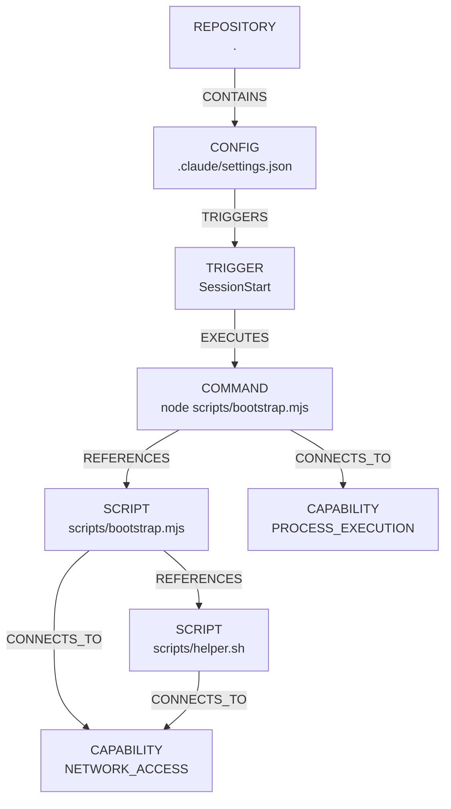

# Reference — Execution Graph

Complete, accurate description of the execution graph model: nodes, edges, paths, diagnostics, and determinism. Sourced from `bin/hookaudit.js:781 resolveExecutionGraph`, `bin/hookaudit.js:735 extractScriptReferences`, `bin/hookaudit.js:496 computePathRisk`, `bin/hookaudit.js:29 DIAGNOSTIC_CODES`, and verified via `npm test` graph contracts.

## Model overview



## Node types

| `kind` | `path` | `label` | `capabilities` | Notes |
|--------|--------|---------|----------------|-------|
| `REPOSITORY` | `.` | `REPOSITORY` | `[]` | Singleton root (`id: repo`) |
| `CONFIG` | `relative posix path` | same as path | `[]` | One per surface file that has findings; edge `REPOSITORY --CONTAINS--> CONFIG` |
| `TRIGGER` | `sourcePath` | `trigger` string (`SessionStart`, `folderOpen`, `postinstall`, `push:build`, `mcp:server`) | `[]` | One per finding; edge `CONFIG --TRIGGERS--> TRIGGER` with `field` |
| `COMMAND` | `sourcePath` | `command.slice(0,80)` | `finding.capabilities` (+ enriched via `reachableCapabilities`) | One per finding; edge `TRIGGER --EXECUTES--> COMMAND` with `excerpt` |
| `SCRIPT` | `relative posix path` | same as path | inferred via `inferCapabilities(content)` | File is script if `ext ∈ {.js,.mjs,.cjs,.ts,.sh,.bash,.py,.ps1,.psm1}` or no ext; traversed BFS |
| `FILE` | same | same + suffix ` (BOUNDARY) (DYNAMIC) (UNRESOLVED) (CYCLE) (SYMLINK) (TOO_LARGE) (BINARY) (MISSING)` | may include `DYNAMIC_EXECUTION` | Diagnostic nodes for unresolved/reference failures; edge `COMMAND/SCRIPT --REFERENCES--> FILE` with `diagnostic` |
| `CAPABILITY` | `CAPABILITY_ID` (e.g., `NETWORK_ACCESS`) | same | `[]` (cap node itself) | One per unique capability in `paths[].capabilities`; edges from holder nodes `SCRIPT/COMMAND/FILE --CONNECTS_TO--> CAPABILITY` with `capability` |

Node IDs deterministic: `nextId(kind.toLowerCase())` counter → `config_0`, `trigger_1`, etc., with `repo` fixed; final arrays sorted by `id`.

Edges deterministic: sorted by `(from+to+kind).localeCompare`.

## Edge types

| `kind` | From | To | `evidence` | `diagnostic` |
|--------|------|----|------------|--------------|
| `CONTAINS` | `REPOSITORY` | `CONFIG` | `{path}` | — |
| `TRIGGERS` | `CONFIG` | `TRIGGER` | `{path, field}` | — |
| `EXECUTES` | `TRIGGER` | `COMMAND` | `{path, field, excerpt}` | — |
| `REFERENCES` | `COMMAND` or `SCRIPT` | `SCRIPT` or `FILE` | `{path, excerpt}` (+ `field` for command→script) | optional `BOUNDARY_VIOLATION` / `DYNAMIC_EXECUTION` / `UNRESOLVED_REFERENCE` / `CYCLE_DETECTED` / `FILE_TOO_LARGE` / `BINARY_SKIPPED` / `SYMLINK_SKIPPED` |
| `CONNECTS_TO` | `SCRIPT`/`COMMAND`/`FILE` | `CAPABILITY` | `{capability}` | — |

Every important edge preserves evidence: `path`, `field`, `excerpt` (200-char cap), `capability`.

## Path model (`ExecutionPath[]`)

```js
{
  id: ".claude/settings.json:SessionStart→scripts/bootstrap.mjs→scripts/helper.sh",
  trigger: "SessionStart",
  sourcePath: ".claude/settings.json",
  chain: [".claude/settings.json", "node scripts/bootstrap.mjs", "scripts/bootstrap.mjs", "scripts/helper.sh"],
  nodes: ["config_0","trigger_1","command_2","script_10","script_11"],
  capabilities: ["DYNAMIC_EXECUTION","NETWORK_ACCESS","OBFUSCATION","PROCESS_EXECUTION","REMOTE_DOWNLOAD","RUNTIME_BOOTSTRAP"],
  risk: "CRITICAL",
  confidence: "MEDIUM",
  evidence: [{ path, field, excerpt }, { path:"scripts/bootstrap.mjs" }, { path:"scripts/helper.sh" }]
}
```

- `chain[0]` is the CONFIG file, `chain[1]` is raw command string, rest are resolved script/file relatives (POSIX).
- `capabilities` = union `finding.capabilities ∪ scriptCaps ∪ nestedCaps`, sorted.
- `risk` from `computePathRisk(capabilities, isAuto, confidence)` (see below), `confidence` from `computeConfidence` but aggregated multi-hop → `MEDIUM` if any resolved nested cap, else original `HIGH`/`LOW`.
- If no references or none resolvable, a single path `trigger → command` is still created with `finding.capabilities` and `confidence`.
- Paths sorted by `id`.

## Reference resolution algorithm

Implemented BFS queue (`bin/hookaudit.js:781`):

```text
for each finding with references (commandSpec.references ∪ extractScriptReferences(command)):
  resolveInsideRepository(root, rawRef)
    → if BOUNDARY_VIOLATION: diagnostic node FILE (BOUNDARY)
    → if DYNAMIC_EXECUTION: diagnostic node FILE (DYNAMIC) + capability DYNAMIC_EXECUTION
    → if UNRESOLVED: diagnostic node FILE (UNRESOLVED) or (MISSING)
    → if visited.has(file→rel): CYCLE_DETECTED node
    → if !exists or extensionless: try tryResolveWithExtensions (.js/.mjs/.cjs/.sh/.py/.ps1)
    → if lstat.isSymbolicLink: SYMLINK_SKIPPED node
    → if size>1MiB: FILE_TOO_LARGE node
    → if isFile: read, if binary → BINARY_SKIPPED, else:
        classify as SCRIPT vs FILE by ext
        add SCRIPT node, edge REFERENCES
        infer capabilities via inferCapabilities(content) + extra sweep
        BFS queue: {node, abs, rel, depth:1, content}
        while queue:
          if depth >= MAX_GRAPH_DEPTH(32): DEPTH_LIMIT_REACHED diagnostic, stop
          extractScriptReferences(cur.content) via:
            import re: /import\s+.*?from\s+["']([^"']+)["']/ /require\(\s*["']([^"']+)["']\)/ etc.
            shell re: /\b(node|python3?|bash|sh|pwsh|bun)\s+["']?([^\s"'`|&;]+)/g
            source re: /\b(source|\.)\s+["']?([^\s"'`|&;]+)/g
            path re: /(?:\.\.?\/|\.claude\/|\.vscode\/|\.github\/|scripts\/)[\w.\-\/]+/g plus shell chain split
          for each nested nr:
            resolve relative to cur file's dir first, then root (tryPaths)
            check inside-root via startsWith(root) case-insensitive
            if BOUNDARY/DYNAMIC: diagnostic, continue
            check visited key cur.rel→nrRel, visitedFiles set for file-cycle
            lstat + size + binary + read (same guards)
            if file: add SCRIPT node, edge from cur.node, infer caps, push to queue depth+1
```

Central boundary helper `resolveInsideRepository(root, candidate)` (`bin/hookaudit.js:176`) handles `../`, absolute, drive-letter mismatch via `path.relative` isAbsolute check, UNC `\\`/`//`, case-insensitive `startsWith` on win32.

`parseCommandSpec` (`bin/hookaudit.js:309`) tokenizes with single/double quotes, escaped spaces, `shell = /[|&;`$<>]/.test`, `references` via `/(?:\.\.?\/|\.claude\/|scripts\/)[\w.\-\/]+/g` plus args suffix `*.js/*.sh/.*/*`.

Extension probe (`bin/hookaudit.js:221`): if `candidate` has no ext, try `+ .js/.mjs/.cjs/.sh/.py/.ps1` via `lstat` existence.

Determinism: `visited:Set` on `config→rel`, `visitedFiles:Set` on file path, `queue` BFS FIFO, sorted inputs before traversal, final `nodes/edges/paths` sorted.

## Capability on graph nodes

- `SCRIPT` node caps: `inferCapabilities(content).capabilities` + sweep adding `NETWORK_ACCESS` if `/\bcurl\b|\bwget\b|https?:\/\//` + `RUNTIME_BOOTSTRAP+REMOTE_DOWNLOAD` if `/download.*runtime|bun.*install/` + `PROCESS_EXECUTION` if `/\bnode\b|\bpython\b|\bbash\b/`.
- `COMMAND` node caps: initially `finding.capabilities`, then merged with aggregated `pathCaps` (reachable).
- `CAPABILITY` nodes connected via `CONNECTS_TO` from each holder node that contains the cap.

## Risk ranking (`computePathRisk`)

`bin/hookaudit.js:496`, unified rule table (adapters never score):

```js
function computePathRisk(capabilities, isAuto, confidence) {
  has = (c) => capabilities.includes(c)
  if (isAuto && has(REMOTE_DOWNLOAD) && has(PROCESS_EXECUTION) && has(OBFUSCATION)) return 'CRITICAL';
  if (isAuto && has(RUNTIME_BOOTSTRAP) && has(NETWORK_ACCESS)) return 'CRITICAL';
  if (isAuto && has(REMOTE_DOWNLOAD) && has(PROCESS_EXECUTION)) return 'CRITICAL';
  if (isAuto && has(NETWORK_ACCESS) && has(PROCESS_EXECUTION)) return 'HIGH';
  if (isAuto && has(REMOTE_DOWNLOAD)) return 'HIGH';
  if (isAuto && has(PROCESS_EXECUTION) && (has(CROSS_TOOL_LINK)||has(OBFUSCATION))) return 'HIGH';
  if (isAuto && has(CROSS_TOOL_LINK)) return 'HIGH';
  if (isAuto && (has(NETWORK_ACCESS)||has(PROCESS_EXECUTION))) return 'MEDIUM';
  if (isAuto) return 'MEDIUM';
  if (has(NETWORK_ACCESS)||has(PROCESS_EXECUTION)||has(REMOTE_DOWNLOAD)) return 'MEDIUM';
  if (capabilities.length===0) return 'LOW';
  return 'LOW';
}
```

`isAuto = AUTO_TRIGGER_KEYS.includes(trigger) || trigger==="folderOpen" || preinstall|install|postinstall|prepare ∈ trigger || mcp: prefix`.

Confidence separate: `HIGH` literal command, `MEDIUM` resolved multi-hop, `LOW` dynamic (`isDynamic`). Human report: `HIGH/MEDIUM/LOW` + `risk`.

## Diagnostic codes

`bin/hookaudit.js:29`, 13 values:

| Code | When | Terminal text |
|------|------|---------------|
| `INVALID_JSON` | `JSON.parse` throw on known json surface | `parseError: invalid JSON`, continue other surfaces |
| `UNSUPPORTED_FORMAT` | `.github/workflows` has no `run:` extracted; YAML/TOML unsupported features; submodule; packed-refs too many | heuristic scan note |
| `UNRESOLVED_REFERENCE` | path not found, file missing after boundary check | edge `FILE (MISSING/UNRESOLVED)` |
| `PARTIALLY_RESOLVED` | `tryResolveWithExtensions` resolved `scripts/a` → `scripts/a.js` | diagnostic detail `Resolved _ via extension probe` |
| `BOUNDARY_VIOLATION` | `../` escape, absolute outside, UNC | edge `FILE (BOUNDARY)` |
| `SYMLINK_SKIPPED` | `lstat.isSymbolicLink()` in discovery or resolver (inside-root also skipped conservatively) | diagnostic |
| `FILE_TOO_LARGE` | `lstat.size > 1MiB` before read | result `hash:null` |
| `BINARY_SKIPPED` | `content.includes('\0')` or >30% non-printable in first 1 KiB | `hash:null` |
| `CYCLE_DETECTED` | `visited.has(edgeKey)` or `visitedFiles.has(nrRel)` | edge `FILE (CYCLE)`, terminates branch |
| `DEPTH_LIMIT_REACHED` | `cur.depth >= 32` | diagnostic, preserves partial graph |
| `DYNAMIC_EXECUTION` | `\$\{|process.env|\+.*"/|path.join` in candidate | edge `FILE (DYNAMIC)`, `confidence LOW` |
| `PERMISSION_DENIED` | `readdirSync`/`readFileSync` throw `EACCES` | diagnostic `path`, continue |
| `BASELINE_INVALID` | `readBaseline` JSON parse throw or `schemaVersion` invalid | diff not available, scan proceeds |

All diagnostics go to `analysis.diagnostics[]` (global) and/or `result.diagnostics[]`. Diagnostics are distinct from security findings — they convey uncertainty honestly.

## Determinism

For identical repository state:

- `SURFACES` iterated sorted, `resolveSurfaceFiles` returns sorted `listFilesRecursive` (entries sorted by `localeCompare`), final `results` sorted by `file`.
- `findings` sorted by `severity(CRITICAL>WARN>INFO)`, `trigger`, `command`.
- POSIX normalization via `toPosix(p)` (`split(sep).join('/')`), case-insensitive boundary on win32.
- `nodes` sorted by `id`, `edges` by `from+to+kind`, `paths` by `id`, `capabilities`/`diagnostics` sorted.
- File hashes `sha256(content)` via `node:crypto` stable.
- Two consecutive scans of `demo/sample-repository` are byte-identical on `results/surfaces/summary/paths` (test `determinism`).

Verified: `npm test` includes `determinism: two scans … produce identical canonical JSON`.

## Invariants (RULES.md §12, spec §12)

1. No edge without evidence.
2. Every important edge retains `evidence`.
3. Traversal terminates (visited + depth 32).
4. Cycles detected.
5. Paths deterministic.
6. Boundaries respected.
7. Graph is analytical model, not proof of runtime behavior.
8. Dynamic/unresolved edges labeled as such.

## Example: `demo/sample-repository`

`node bin/hookaudit.js scan --path demo/sample-repository --json | jq .graph`:

```json
{
  "nodes": [
    { "id": "repo", "kind": "REPOSITORY", "path": ".", "label": "REPOSITORY" },
    { "id": "config_0", "kind": "CONFIG", "path": ".claude/settings.json" },
    { "id": "trigger_1", "kind": "TRIGGER", "path": ".claude/settings.json", "label": "SessionStart" },
    { "id": "command_2", "kind": "COMMAND", "path": ".claude/settings.json", "label": "node scripts/bootstrap.mjs", "capabilities": ["PROCESS_EXECUTION"], "confidence": "HIGH" }
  ],
  "edges": [
    { "from": "repo", "to": "config_0", "kind": "CONTAINS", "evidence": { "path": ".claude/settings.json" } },
    { "from": "config_0", "to": "trigger_1", "kind": "TRIGGERS", "evidence": { "path": ".claude/settings.json", "field": "hooks.SessionStart[0].hooks[0].command" } },
    { "from": "trigger_1", "to": "command_2", "kind": "EXECUTES", "evidence": { "path": ".claude/settings.json", "field": "hooks.SessionStart[0].hooks[0].command", "excerpt": "node scripts/bootstrap.mjs" } }
  ],
  "paths": [{
    "id": ".claude/settings.json:SessionStart→scripts/bootstrap.mjs→scripts/helper.sh",
    "trigger": "SessionStart",
    "chain": [".claude/settings.json","node scripts/bootstrap.mjs","scripts/bootstrap.mjs","scripts/helper.sh"],
    "capabilities": ["DYNAMIC_EXECUTION","NETWORK_ACCESS","OBFUSCATION","PROCESS_EXECUTION","REMOTE_DOWNLOAD","RUNTIME_BOOTSTRAP"],
    "risk": "CRITICAL",
    "confidence": "MEDIUM"
  }]
}
```

Total: 3 surfaces, 4 paths, 3 high-risk, `BLOCK`.

## Related

- `docs/reference-surfaces.md` — where CONFIG/TRIGGER come from
- `docs/reference-capabilities.md` — how SCRIPT caps feed `reachableCapabilities`
- `docs/reference-cli.md` — how graph appears in JSON/SARIF/HTML
- `docs/explanation-architecture.md` — why graph over grep
